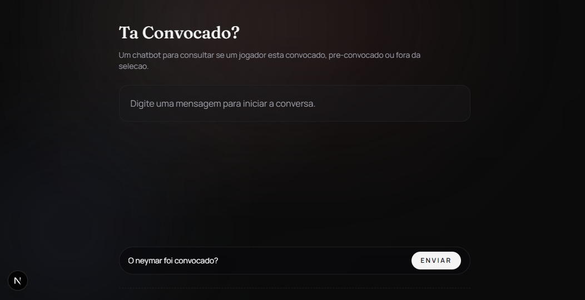
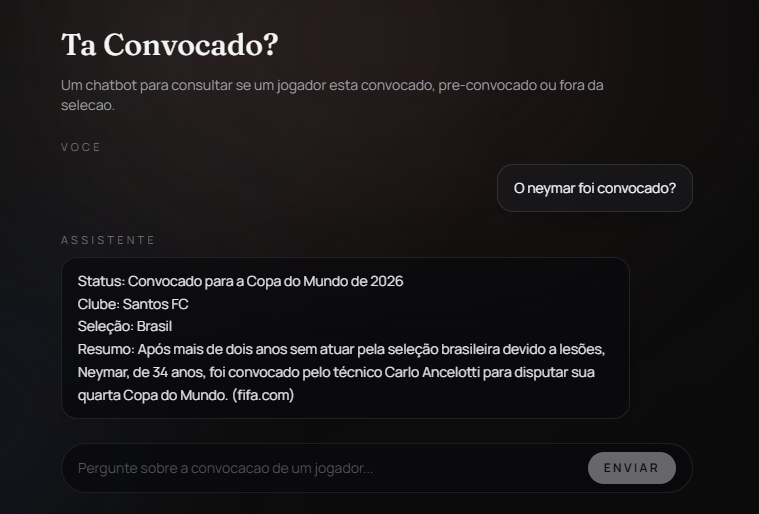

# ⚽ ChatBot - Ta convocado?

> Assistente inteligente que responde em tempo real se um jogador de futebol foi convocado para a **Copa do Mundo de 2026**, com suporte a busca na web e streaming de respostas.

---

## 🛠️ Tecnologias

- [Next.js](https://nextjs.org/) — framework React full-stack
- [Vercel AI SDK](https://sdk.vercel.ai/) — orquestração de LLMs e streaming
- [Web Search Tool](https://www.skills.sh/) — busca em tempo real para dados atualizados

---

## ✨ Funcionalidades

| Recurso | Descrição |
|---|---|
| **Streaming de texto** | Respostas exibidas progressivamente, como se estivessem sendo digitadas |
| **Busca na web** | A IA decide automaticamente quando consultar dados atualizados sobre convocações |
| **RateLimits** | O sistema bloqueia diversas tentativas de requisição vindas do mesmo IP |

---

## 📸 Screenshots

**Tela inicial:**



**Após pergunta e resposta:**



---

## 🚀 Como rodar localmente

```bash
# Clone o repositório
git clone <url-do-repositorio>

# Instale as dependências
npm install

# Configure as variáveis de ambiente
cp .env.example .env.local

# Inicie o servidor de desenvolvimento
npm run dev
```

Acesse `http://localhost:3000` no seu navegador.

---

## 🔐 Segurança *(planejado)*

- **Proteção de rotas da API** — validação de sessão ativa via [Auth.js](https://authjs.dev/) (ex-NextAuth)
- **Criptografia de mensagens** — encriptação antes de persistir no banco de dados

---

## 🔗 Referências

- [llm-stats.com](https://llm-stats.com/) — comparativo de performance entre LLMs
- [skills.sh](https://www.skills.sh/) — catálogo de skills para agentes de IA
